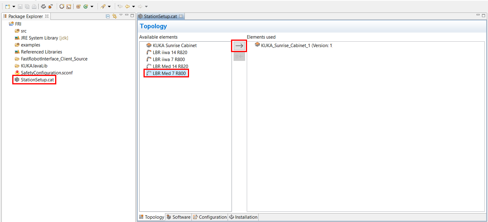
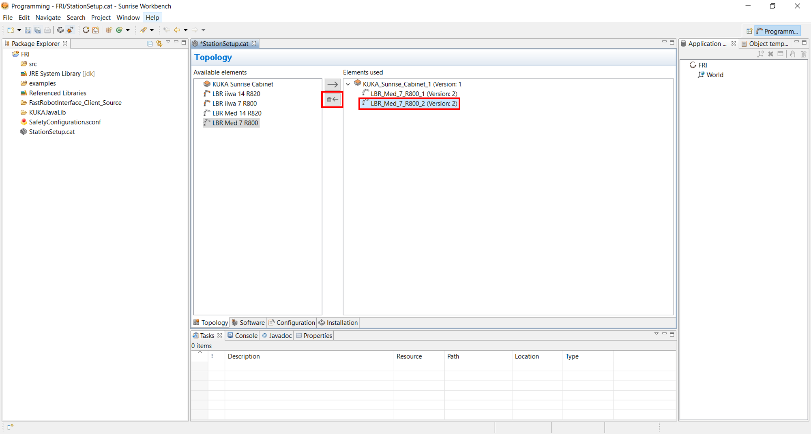
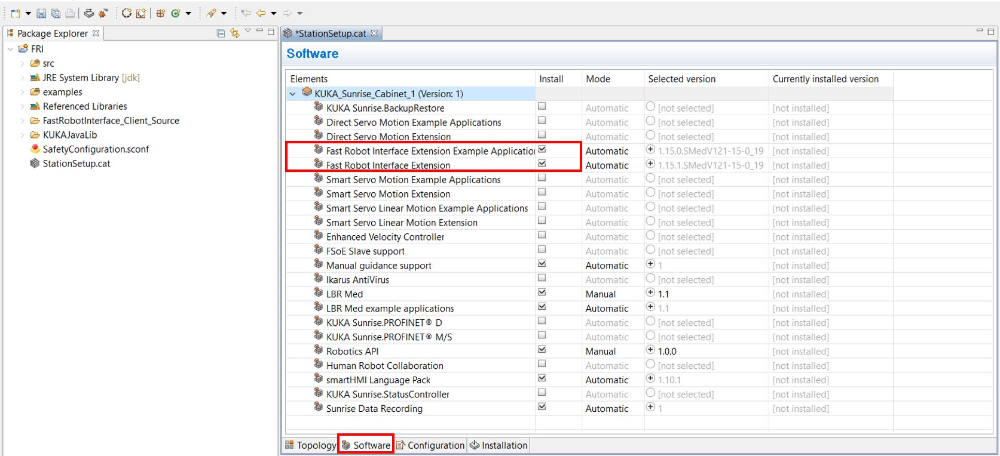
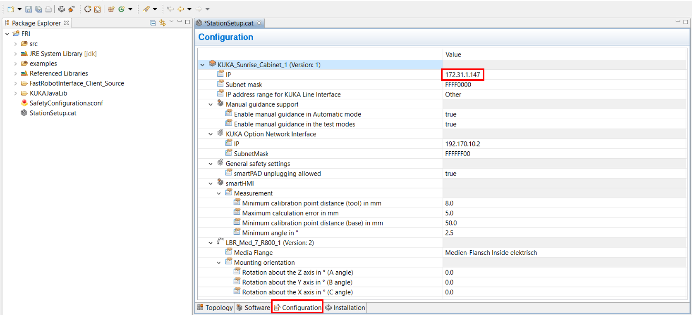
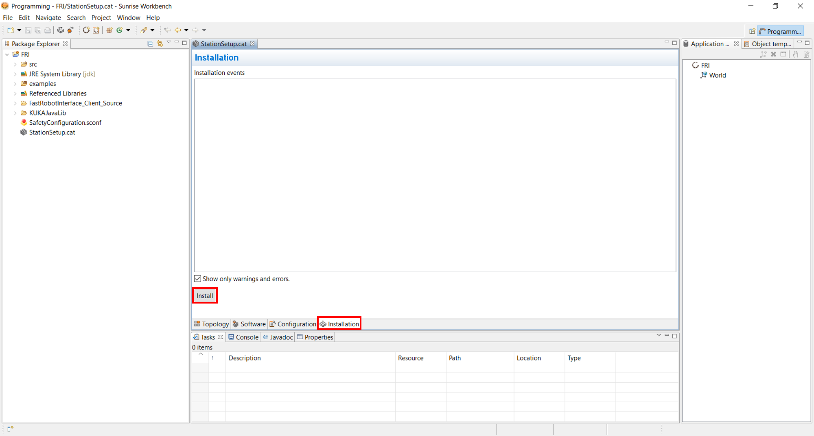
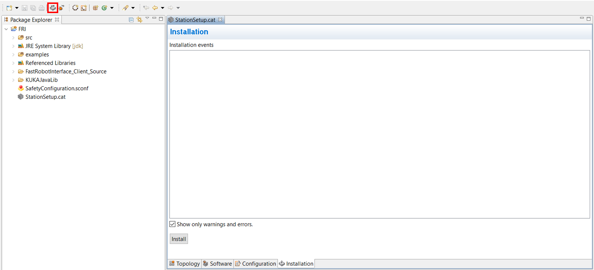

# fri


The Fast Robot Interface (FRI) library allows for hard real time communication to the KUKA LBR Med, see KUKA's [paper](http://www.best-of-robotics.org/pages/publications/KUKA_FRI_from_WS_Proceedings_ICRA2010.pdf). This folder contains the C++ client side library to setup the UDP connection to the LBR Med. However, hard real time is only supported if the FRI is compiled on a real time OS.

## Usage
The FRI comes with [example apps](#example-apps). These apps require some [prerequisites](#prerequisites) that are explained below.

### Prerequisites
Follow the [Build and Installation](#build-and-installation) instructions for your OS. Install [Sunrise Workbench](#sunrise-workbench) on your computer. This step requires Windows as OS.

#### Sunrise Workbench
Sunrise Workbench is KUKA's Java IDE that allows you to program the LBR Med. 
* Download it from the [RViM shared folder](https://emckclac.sharepoint.com/:u:/s/MT-BMEIS-RVIM/ETBf6gp3Ko5EvtJVziR8MZ4BLdeX8ysF13jTVmVreq0iZA?e=XJyagD) 
* Extract the .zip file and run the Sunrise Workbench Setup
* Follow the install instructions

### Example Apps
Exemplary applications for the C++ client side are located inside the [apps](https://github.com/KCL-BMEIS/FastRobotInterface/tree/master/apps) folder. Each of these apps has a Java equivalent for the server side.

#### Connect Laptop
* Connect your laptop, therefore, establish an Ethernet connection to connector X66 at the KUKA controller
* The KUKA controller's default IP is 172.31.1.147. Configure the same network on your laptop, therefore
  * On Windows
    * Search for `View network connections` in Start and open it
    * Right click on the Ethernet connection and open `Properties`
    * Double click Internet Protocol Version 4 (TCP/IPv4) and set the IP address to `172.31.1.148` and the Subnet mask to `255.255.0.0`
  * On Ubuntu 16 (might differ for other Linux distributions)
    * Search for `System Settings` and open it
    * Go to Network -> Wired -> Options
    * Go to the IPv4 Settings tab and set the IP address to `172.31.1.148` and the Netmask to `255.255.0.0` 

#### Server Side - KUKA Controller
You will have to follow the instructions in [Connect Laptop](#connect-laptop). The FRI has to be installed on the controller. Therefore, the [Sunrise Workbench](#sunrise-workbench) IDE is used. 
* Open the Sunrise Workbench
* Create a new project, therefore 
  * Click File -> New -> Sunrise project
  * Leave the default IP (172.31.1.147) and click Next
  * Give your project a name, e.g. FRI and click Next
  * Select LBR Med 7 R800 and click Next
  * Under Media Flange, select Medien-Flansch Inside elektrisch, and click Next
  * Click Finish (might take some time). Select RoboticsAPI Application, and press Next
  * Click Finish
* Setup the KUKA controller, therefore
  * Double click the StationSetup.cat under FRI in the Package Explorer and add the LBR Med 7 R800 to the Topolgy (below left)
  * Remove the LBR_Med_7_R800_2, which has no Media Flange, and which we are not using (below right)
    <figure>
      <p align="center"></p>
      <figcaption></figcaption>
    </figure>
  * In the Software tab, make sure that the checker boxes for the FRI extensions are selected (below left) 
  * In the Configurations tab, make sure that the IP is set to 172.31.1.147 (below right)
  * Save the StationSetup.cat via `Ctrl + s`
    <figure>
      <p align="center"></p>
      <figcaption></figcaption>
    </figure>
  * In the Installation tab, click Install (below left)
  * Synchronize your project with the KUKA controller (below right)
    <figure>
      <p align="center"></p>
      <figcaption></figcaption>
    </figure>

#### Client Side - Laptop
You will have to follow the instructions in [Connect Laptop](#connect-laptop), and make sure that the FRI was installed to the KUKA controller, according to [Server Side - KUKA Controller](#server-side---kuka-controller). The client side requires to build the [apps](https://github.com/KCL-BMEIS/FastRobotInterface/tree/master/apps), which requires that the FRI was installed according to [Build and Installation](#build-and-installation). Then, open a terminal and do
```shell
cd apps
mkdir build
cd build
cmake -DCMAKE_PREFIX_PATH='path/to/lib' .. # on Windows this should be 'C:\Program Files (x86)\FastRobotInterface'
                                           # on Linux this should be '/usr/local'
cmake --build . --config Release           # builds the apps in Release mode
```
