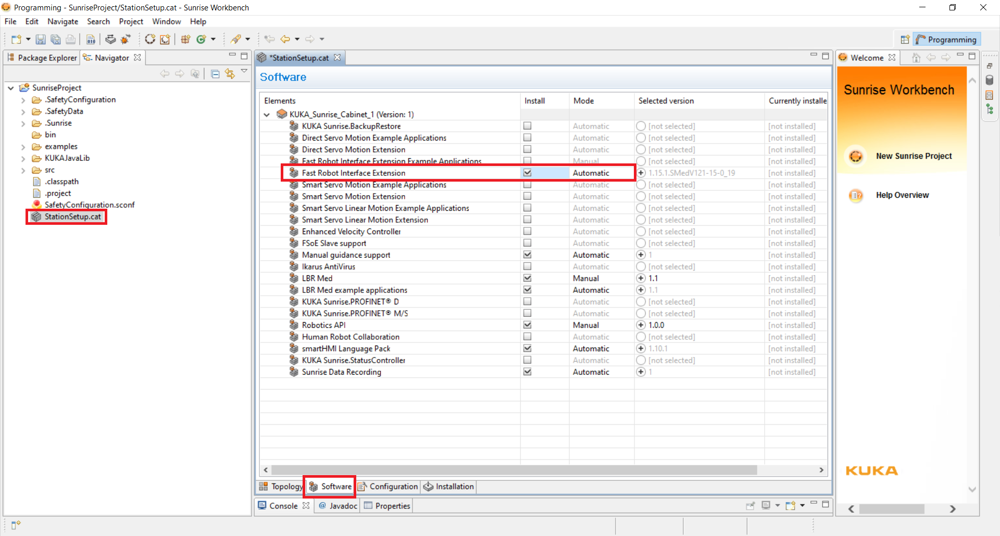
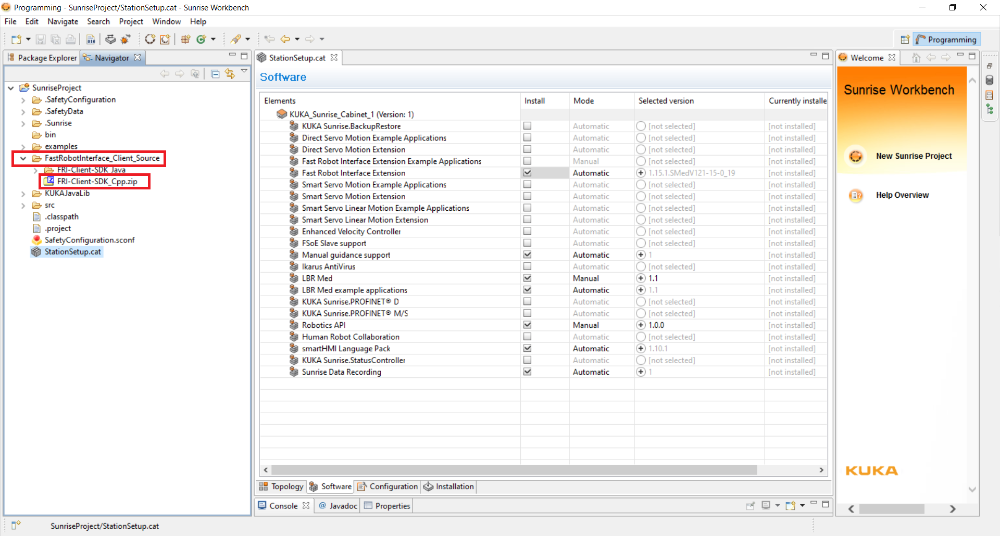

# fri


This folder adds CMake support to KUKA's Fast Robot Interface (FRI).

## Build
To build, run

```shell
cmake -B build -DCMAKE_BUILD_TYPE=Release -DBUILD_FRI_APPS=ON
cmake --build build
```

## Run the Apps
To run the example applications, run

```shell
./build/LBRJointSineOverlayApp
```

On the `smartPAD`, run the `LBRJointSineOverlay` application. You should see the robot execute a sine wave.

## Contributing
Do you use a different FRI version?

1. Fork this repository.
2. Create a branch fri-major.minor (e.g. fri-1.15).
3. Replace `FRI-Client-SDK_Cpp.zip` with your client SDK as extracted from `KUKA Sunrise Workbench`. Therefore (see images):
    * In the `Software` tab of `StationSetup.cat`, add `Fast Robot Interface Extension`.
    * Save via `ctrl+s`, click `Save and apply`.
    * Under `FastRobotInterface_Client_Source`, find `FRI-Client-SDK_Cpp.zip`.

  <figure>
    <p align="center"></p>
    <figcaption></figcaption>
  </figure>

4. Open a pull request.

## License
Please note that we distribute the CMake support under MIT license. Please note that third party libraries under `FRI-Client-SDK_Cpp.zip` are distributed under their respective license.

## Acknowledgements


This work was supported by core and project funding from the Wellcome/EPSRC [WT203148/Z/16/Z; NS/A000049/1; WT101957; NS/A000027/1]. 


This project has received funding from the European Union's Horizon 2020 research and innovation programme under grant agreement No 101016985 (FAROS project).
